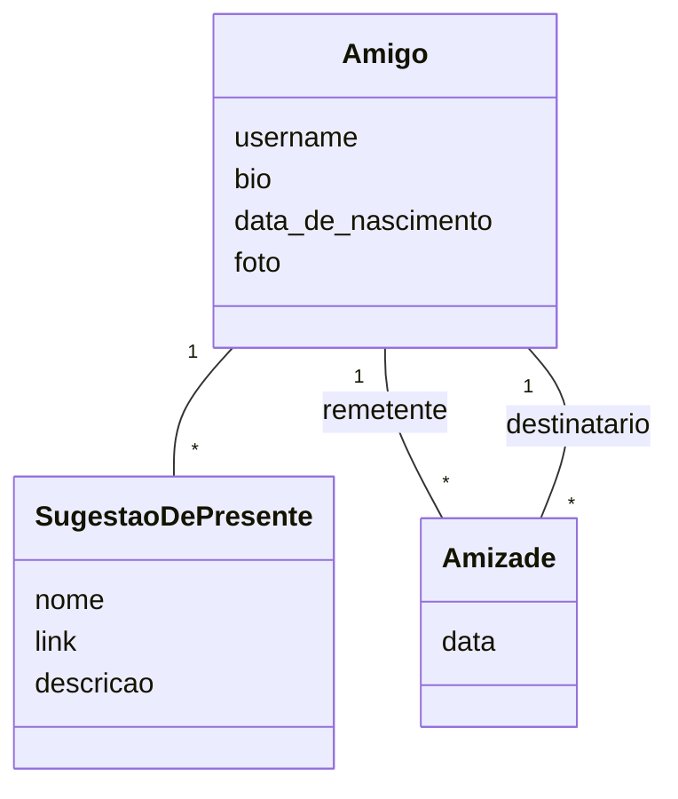

# Mima

Tem problema em dar/receber presentes? Convide todo mundo pra cá!

A funcionalidade principal é poder escolher um item da lista de um amigo sem ele saber, mas os outros amigos dele sabendo que o item já será dado por alguém.

## Objetivos

- [ ] Cadastro/Login
- [ ] Adição de sugestões
...

